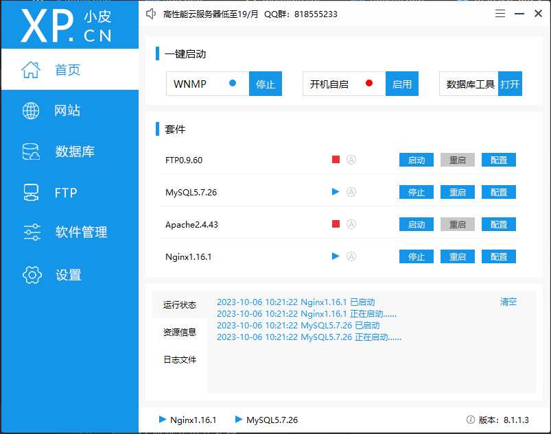

# 🏁简单的学生信息管理系统案例

## 一、功能配备

​		测试地址：http://43.136.39.218/stu/index.php

​		本项目由作者以PHP入门学习为导向，组织团队录制视频，是初学者必备入门项目，使用HTML、PHP、MySQL等技术，配备Web前后端的基本知识体系、教学视频和教学PPT，开源供初学者进行学习，同时作为若水学习会程序开发组的入门票、校园Web程序开发公选课的教学内容，具有较强的实践性和实际价值！

## 二、学习配套视频

百度网盘链接：https://pan.baidu.com/s/1bUzFEuG6DaC5_g0ccjFlKQ?pwd=yyds 

提取码：yyds

## 三、项目部署

> 1. git仓库克隆 
>
>    `git clone https://github.com/xiaopacairq/student.git`
>
> 2. 需要php7以上、MySQL5.7以上，可通过下载WAMP、phpstudy等集成工具快速部署
>
>    
>
> 3. 导入数据表
>
>    使用phpstudy的phpmyadmin或者其他数据库管理工具，导入`mydemo.sql`
>
>    ```sql
>    -- phpMyAdmin SQL Dump
>    -- version 4.1.14
>    -- http://www.phpmyadmin.net
>    --
>    -- Host: 127.0.0.1
>    -- Generation Time: 2022-07-23 04:59:01
>    -- 服务器版本： 5.6.17
>    -- PHP Version: 5.5.12
>    
>    SET SQL_MODE = "NO_AUTO_VALUE_ON_ZERO";
>    SET time_zone = "+00:00";
>    
>    
>    /*!40101 SET @OLD_CHARACTER_SET_CLIENT=@@CHARACTER_SET_CLIENT */;
>    /*!40101 SET @OLD_CHARACTER_SET_RESULTS=@@CHARACTER_SET_RESULTS */;
>    /*!40101 SET @OLD_COLLATION_CONNECTION=@@COLLATION_CONNECTION */;
>    /*!40101 SET NAMES utf8 */;
>    
>    --
>    -- Database: `mydemo`
>    --
>    
>    -- --------------------------------------------------------
>    
>    --
>    -- 表的结构 `stu`
>    --
>    
>    CREATE TABLE IF NOT EXISTS `stu` (
>      `stu_no` int(11) NOT NULL AUTO_INCREMENT,
>      `stu_name` varchar(30) NOT NULL,
>      `gender` varchar(3) NOT NULL,
>      `telephone` varchar(11) NOT NULL,
>      `age` int(5) NOT NULL,
>      `college` varchar(50) NOT NULL,
>      PRIMARY KEY (`stu_no`)
>    ) ENGINE=InnoDB  DEFAULT CHARSET=utf8 AUTO_INCREMENT=20003 ;
>    
>    --
>    -- 转存表中的数据 `stu`
>    --
>    
>    INSERT INTO `stu` (`stu_no`, `stu_name`, `gender`, `telephone`, `age`, `college`) VALUES
>    (20001, '小张', '男', '13415159639', 22, '土木工程学院'),
>    (20002, '小李', '男', '13415159640', 20, '土木工程学院 ');
>    
>    /*!40101 SET CHARACTER_SET_CLIENT=@OLD_CHARACTER_SET_CLIENT */;
>    /*!40101 SET CHARACTER_SET_RESULTS=@OLD_CHARACTER_SET_RESULTS */;
>    /*!40101 SET COLLATION_CONNECTION=@OLD_COLLATION_CONNECTION */;
>    
>
> 4. 配置数据库 ,需手动配置`conn.php`文件
>
>    ```php
>    $dbtype = 'mysql'; //设置数据库类型
>    $host = 'localhost'; // 设置主机名称
>    $dbname = 'mydemo'; //设置数据库名称
>    $username = 'root'; // 设置数据库用户名
>    $password = '123456'; // 设置数据库密码
>    $port = 3306; //设置数据库端口
>    
>    // 创建数据源
>    $dsn  = "{$dbtype}:host={$host};port={$port};dbname={$dbname}";
>    
>    try {
>        //实例化PDO获取数据库连接
>        $pdo = new PDO($dsn, $username, $password);
>        $pdo->query("set names utf8");
>    
>        // echo '连接成功';
>    } catch (PDOException $e) {
>        //捕获异常并处理
>        die('连接失败' . $e->getMessage());
>    }
>    ```
>
>    
>
> 5. 浏览器端指向index.php入口文件，出现主页，即可！
>
>    

[^备注]:遇到任何问题随时可`issue`我，或者发邮件到`srq13415151737@163.com`


